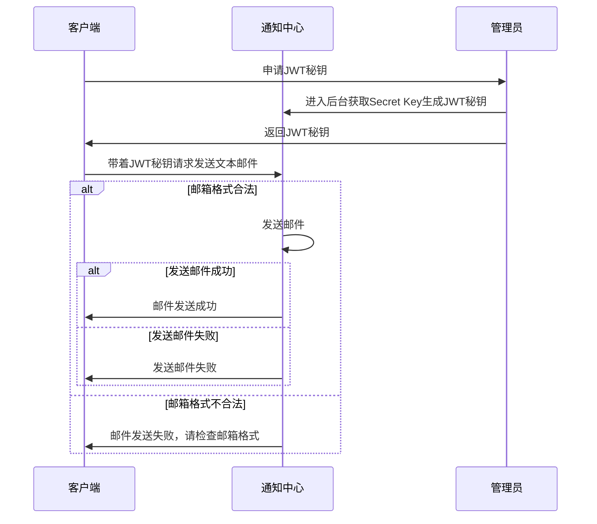

<center><h1>通用的通知中心设计</h1></center>

## 背景简介

​		在平常的项目中经常需要用到消息通知功能，比如邮件通知、短信通知、公众号通知等等，但是如果在每个项目中独立实现则非常麻烦，而且重复造轮子，极大程度地降低了开发效率，为了简化开发流程，降低重复工作量，故此将通知中心这一通用模型独立出来，作为一个单独的系统搭建。

​		整个模型架构图如下，是以Spring Boot为基础，遵循Restful接口规范、阿里巴巴Java开发规范，使用Fluent MyBatis读写数据库，部署之后使用Nginx搭配SSL证书反向代理https请求到实际的通知中心。


## 功能演示

#### 在线测试

​		这里提供一个无需身份认证可直接测试的接口：直接访问[https://document.codeclub.fun/email/test?email=***@qq.com](http://localhost:8001/email/test?email=***@qq.com)即可在对应的邮箱中收到测试邮件，比如将链接中的邮箱改为我的QQ邮箱会受到如下邮件：


#### 发送简单文本邮件

请求方式为POST：

```
POST /email/text
```

> 请求参数

| 名称          | 位置   | 类型   | 必选 | 说明                            |
| ------------- | ------ | ------ | ---- | ------------------------------- |
| Authorization | header | string | true | 身份验证token，由系统管理员签发 |
| receiver      | body   | string | true | 收件人                          |
| subject       | body   | string | true | 邮件主题                        |
| context       | body   | string | true | 邮件正文                        |

> Body 请求参数示例 

```
receiver: 1791781644@qq.com
subject: 测试主题
context: 登录操作通知：\r\n您的帐户 17*****@qq.com 正在尝试登录，请使用该验证码登录：****，验证码5分钟内有效。\r\n如果这不是你发送的邮件，请直接忽略，谢谢! xxx开发团队。
```

> Apifox请求示例


>  返回结果

| 响应code | 响应code含义 | 响应信息(msg)  | 响应数据(data) |
| -------- | ------------ | -------------- | -------------- |
| 200      | 发送邮件成功 | 发送邮件成功   | 无             |
| 400      | 发送邮件失败 | 邮箱不能为空   | 无             |
| 400      | 发送邮件失败 | 邮箱格式不合法 | 无             |

> 返回结果示例

```json
{
    "code": 200,
    "msg": "发送邮件成功",
    "data": null
}
```

> 邮件示例


#### 发送html邮件

请求方式为POST：

```
POST /email/html
```

> 请求参数

| 名称          | 位置   | 类型   | 必选 | 说明                            |
| ------------- | ------ | ------ | ---- | ------------------------------- |
| Authorization | header | string | true | 身份验证token，由系统管理员签发 |
| receiver      | body   | string | true | 收件人                          |
| subject       | body   | string | true | 邮件主题                        |
| context       | body   | string | true | 邮件正文，为HTML格式            |

> Body 请求参数示例 

```
receiver: 1791781644@qq.com
subject: 测试主题
context: "<div style=\"margin: 0 auto; padding: 40px; text-align: center;
  height: 100%; overflow: hidden; box-sizing: border-box; max-width: 800px\">\r
  \    <h2 style=\"font-size: 2em\">\r
  \        邮件测试\r
  \    </h2>\r
  \    <div style=\"font-size: 1.2em;\">\r
  \        这是一封html测试邮件，整个项目的代码在\r
  \        <a style=\"color: #177EE6\" href=\"https://github.com/404-error-404/notification_center\">\r
  \            Github\r
  \        </a>\r
  \    </div>\r
  \    <div style=\"width: 100%; margin: 0 auto;\">\r
  \        \r
  \    </div>\r
  </div>"
```

> Apifox请求示例


> 返回结果

| 响应code | 响应code含义 | 响应信息(msg)  | 响应数据(data) |
| -------- | ------------ | -------------- | -------------- |
| 200      | 发送邮件成功 | 发送邮件成功   | 无             |
| 400      | 发送邮件失败 | 邮箱不能为空   | 无             |
| 400      | 发送邮件失败 | 邮箱格式不合法 | 无             |

> 返回结果示例

```json
{
    "code": 200,
    "msg": "发送邮件成功",
    "data": null
}
```

#### 其他功能

发送短信功能需要额外付费，这里无法提供演示。

## 主要模块简介

#### 环境

+ 操作系统

  开发环境为Windows 10 专业版 20H1 (内部版本19043.1526)

  服务器部署环境为Ubuntu 20.04.4 LTS

+ Java

  开发环境为oracle JDK 17.0.2 LTS

  服务器部署环境为Open JDK 17.0.1

+ MySQL

  开发环境为MySQL server 8.0.26

  服务器部署环境为MySQL server 8.0.28

+ Nginx

  开发环境直接访问8001端口

  服务器部署环境为Nginx 1.18.0

+ 邮箱

  这里选择的是腾讯企业邮箱，可以根据实际情况选择合适的邮箱，只要是支持smtp服务的邮箱即可。

#### 功能设计

​		基础功能采用Spring Boot实现，数据库读写采用Fluent MyBatis实现，系统间鉴权则采用JWT(Json Web Token)实现身份认证。初次使用系统需要获取管理员签发的JWT秘钥，这里需要管理员登录后台服务器拿到Secret Key然后手动签发JWT秘钥后发给客户端负责人，后续解决完客户端的权限问题后会考虑全部升级为自动签发。整个模型的大致流程如下：




#### Spring Boot基础框架

​		Spring Boot是当下最流行的Java web服务框架，是为了简化Spring MVC过度复杂的配置而实现的Spring引导框架，简单讲就是遵循“契约式编程”思想，约定一套规则，通过牺牲项目的自由度来减少配置的复杂度，把这些框架都自动配置集成好，从而达到“开箱即用”的目的。当然，Spring Boot同时也支持自由配置，本质上他还是一个Maven项目，可以通过在`pom.xml`中添加依赖的方式添加自己所需的配置，如Spring Data JPA、Spring Boot starter web、 fastjson等常用功能。

​		另外，Spring Boot中支持`HandlerInterceptor`拦截器，通过实现自己所需的拦截器可以实现在请求到达之前的预处理操作，在本项目中自定义了`LoginInterceptor`来进行登录鉴权，在收到前端请求时从请求头中取出`Authorization`数据，正常情况下该数据应该为系统签发的JWT(Json Web Token)，其中包含了用户的相关信息，关于JWT的详细信息会在下一小节讲解，鉴权通过后放行，鉴权失败则直接返回认证失败。对于一些无需登录的接口，本项目实现了免登陆注解`LoginExcept`，在拦截器中检查对应的接口是否添加了`LoginExcept`注解，如果添加则跳过身份认证，否则继续执行。


#### 使用JWT进行系统间鉴权

​		JWT全称是Json Web Token，是为了在网络应用环境间传递声明而执行的一种基于Json的开放式标准，这个token被设计为紧凑且安全的，特别适用于分布式站点的单点登录（SSO）场景。JWT的声明一般被用来在身份提供者和服务提供者间传递被认证的用户身份信息，以便于从资源服务器获取资源，也可以增加一些额外的其它业务逻辑所必须的声明信息，该token也可直接被用于认证，也可被加密。与传统的session和cookies相比，session经过认证后需要在服务端做一次记录，以便用户下次请求的鉴权，这样服务器端的开销会明显增大，而基于cookies的鉴权也有很大的问题，但是如果cookies被截获就会很容易收到跨站请求伪造的攻击。而JWT则是和http一样是无状态的，他不需要在服务端存储用户的认证信息或者会话信息，极大程度地降低服务器的消耗，另外，JWT中的`playload`部分可以存放一些可以公开的信息，比如将用户的基础信息存储进去，这样就可以在认证时直接获取到用户的信息，可以减少从数据库查询用户信息的次数，以此降低数据库压力。

#### Fluent MyBatis配置数据库

​		MyBatis是Spring Boot下一个高效的数据库操作工具，但是因为配置太过复杂，所以这里选择MyBatis的语法增强框架Fluent MyBatis实现数据库的增删改查。Fluent MyBatis的配置非常简单，只需要配置相应的生成类，这里给出相应的配置类代码，各个参数的详细信息请查看代码中的注释。将下边类放在Spring Boot项目的`src.test.java.项目包名`目录下，然后直接运行即可生成指定表对应的实体类和数据库操作相关的mapper文件以及dao文件等，最后只需要在Spring Boot启动类上添加`MapperScan`注解即可，完整注解示例：`@MapperScan({"general.notification_center.mapper"})`。

```java
package general.notification_center;

import cn.org.atool.generator.FileGenerator;
import cn.org.atool.generator.annotation.Table;
import cn.org.atool.generator.annotation.Tables;
import org.junit.jupiter.api.Test;
import org.springframework.boot.test.context.SpringBootTest;

@SpringBootTest
public class EntityGeneratorTests {

    // 数据源 url
    static final String url = "jdbc:mysql://localhost:3306/notify_center?useUnicode=true&characterEncoding=utf8";
    // 数据库用户名
    static final String username = "root";
    // 数据库密码
    static final String password = "root";

    @Test
    public void generate() {
        // 引用配置类，build方法允许有多个配置类
        FileGenerator.build(Empty.class);
    }

    @Tables(
            // 设置数据库连接信息
            url = url,
            username = username,
            password = password,
            // 设置entity类生成src目录, 相对于 user.dir
            srcDir = "src/main/java",
            // 设置entity类的package值
            basePack = "general.notification_center",
            // 设置dao接口和实现的src目录, 相对于 user.dir
            daoDir = "src/main/java/",
            // 设置哪些表要生成Entity文件
            tables = {@Table(value = {"hello_world", "apps"})}
    )
    static class Empty { //类名随便取, 只是配置定义的一个载体
    }

}
```

## 运行教程

​		首先需要写配置文件，将`src/main/resources`目录下的`application.example.yml`文件拷贝到同目录下并且重命名为`application.example.yml`，然后根据如下规则修改为自己的配置，其中需要注意的是，`spring.mail.nickname`和`sys_params.jwt_secret_key`为两个手动添加的变量，`nickname`为发送邮件时收件人客户端显示的发件人昵称；`jwt_secret_key`则是签发和验证JWT时的秘钥，设置地越负责，加密的token就越安全。

```yaml
server:
    port: 8001
spring:
    mail:
        host: 对应邮件服务的smtp服务器地址
        username: 发件人邮箱账号
        nickname: 发件人昵称
        password: 发件人邮箱密码
        default-encoding: UTF-8
        port: 465   # 一般smtp服务器端口为465
        properties:
            mail:
                smtp:
                    ssl:
                        enable: true
        test-connection: true
    datasource:
        driver-class-name: com.mysql.cj.jdbc.Driver
        url: jdbc:mysql://{{换成你自己的ip}}:3306/notify_center?useUnicode=true&characterEncoding=utf-8
        username: xxxx
        password: xxxx

sys_params:
    jwt_secret_key: 随便输一个字符串，越复杂加密的token就越安全
```

​		接着直接安装`pom.xml`中的相关相关依赖，注意不要随便修改版本，可能会造成不兼容的问题，然后直接本地运行项目，这时候会自动运行已经配置好的Fluent MyBatis测试函数，生成数据库读写对应的`mapper`、`dao`等相关文件，至此项目运行成功，直接访问[http://localhost:8001/](http://localhost:8001/)即可查看。

## 参考文献

[1] markdown - 画图[EB/OL]. https://blog.csdn.net/lis_12/article/details/80693975, 2018-6-14

[2] Spring Boot 简单整合 fluent-mybatis 实现数据的增删改查[EB/OL]. https://blog.csdn.net/xiuaiba/article/details/119457606, 2021-8-16

[3] JWT全面解读、使用步骤[EB/OL]. https://blog.csdn.net/achenyuan/article/details/80829401, 2018-6-27
